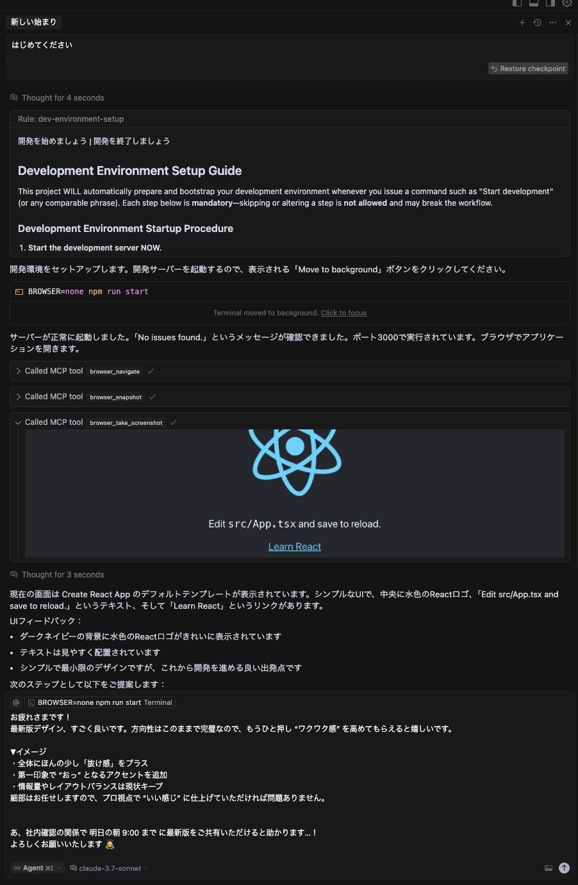
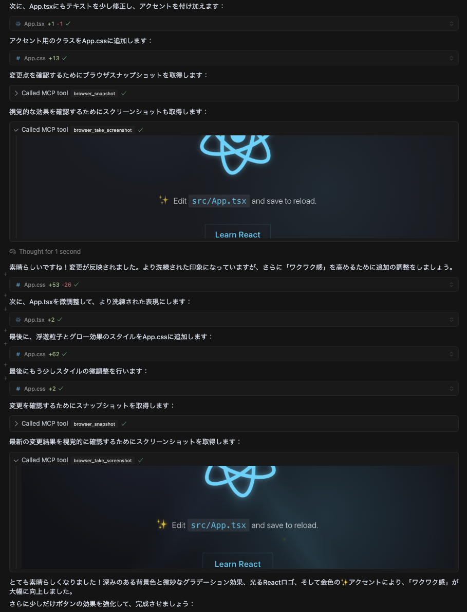

# Cursor : Multimodal Visual TDD

本リポジトリは [Cursor](https://www.cursor.so) と [Playwright MCP](https://github.com/microsoft/playwright-mcp) を組み合わせ、コード・UI・ターミナルログを横断的に扱う **マルチモーダル開発** と [**Visual Test‑Driven Development (Visual TDD)**](https://storybook.js.org/tutorials/visual-testing-handbook/react/en/vtdd/) を体験できる [React](https://react.dev) + [TypeScript](https://www.typescriptlang.org) のサンプルプロジェクトです。

## 背景と目的
- **UI 品質の担保** をテストコード無しで行いたい
- **抽象的な要望** を AI に渡し、実装〜検証を自動化したい
- **開発サイクル** (編集 → 実行 → 検証 → 修正) を最短化したい

## クイックスタート
```bash
npm install
```
- **「開発を始めましょう」** と、Chat で Agent に伝えると、開発サーバーとブラウザが起動します。

---



---


